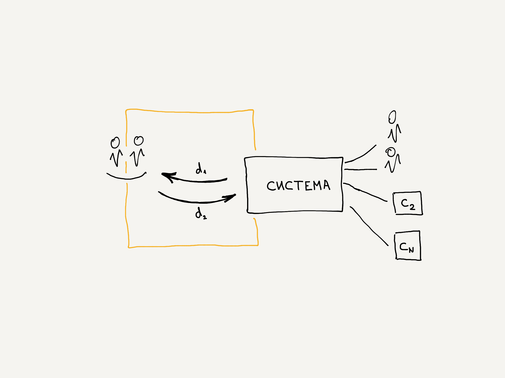
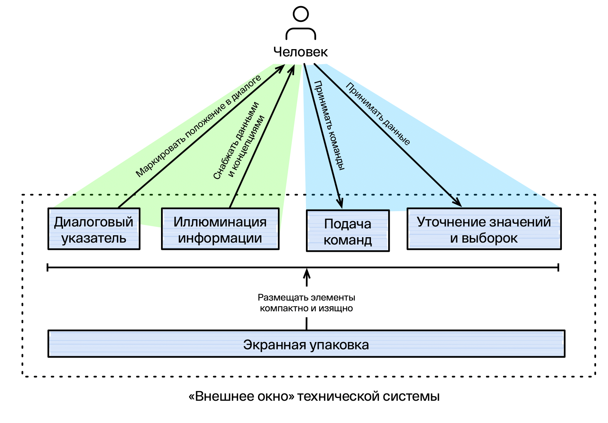
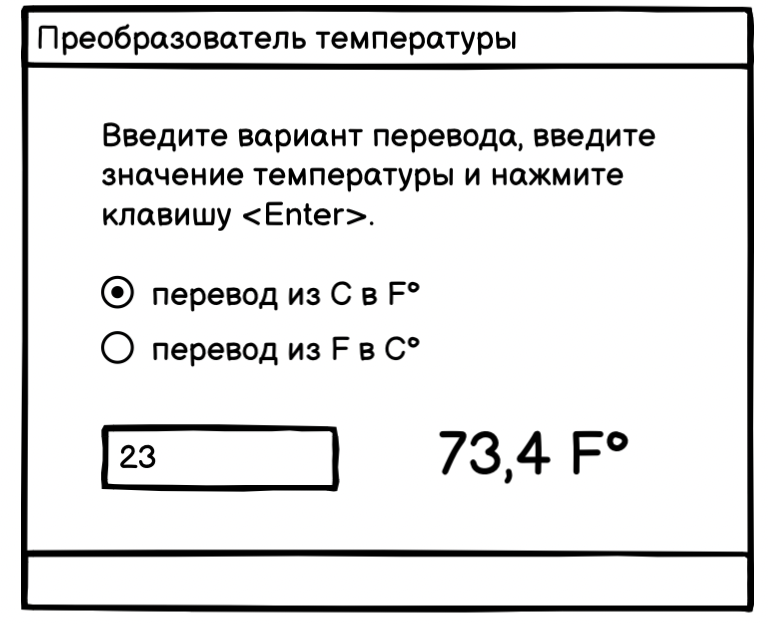
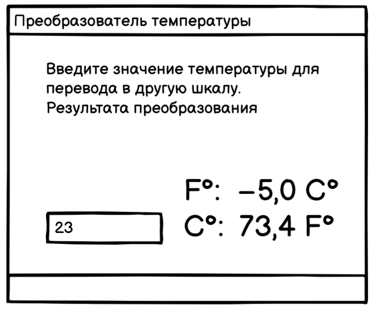
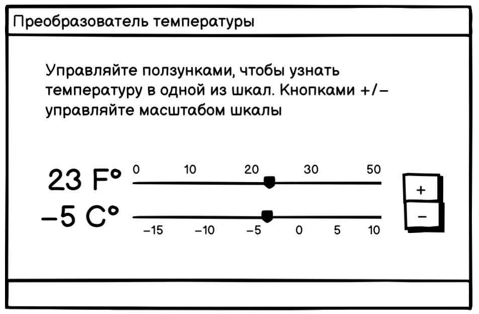

# Структурный язык описания интерфейсных ситуаций

> Предложен подход к структурному описанию интерфейсных ситуаций в символьном виде. Структурный означает по возможности лишённый конечной формы элементов интерфейса. Каждая формула языка описывает ситуацию за счёт указания на структуру данных входа и выхода и ход необходимого преобразования.

## Преамбула

Сфера интерфейса пользователя (User Interface) довольно молода по меркам таких разделов инженерного дела как электротехника и машиностроение. Уже предприняты отдельные попытки сборки «театра машин» в области интерфейсов, есть отдельные сортаменты, относящиеся к платформам гигантам. Однако все имеющиеся справочники и примеры работают на уровне конечной формы и предлагают конкретные варианты.

Целью нашего исследования было получить первоформы или архетипы интерфейсных элементов и сборок (агрегатов) и выйти на язык описания интерфейсных ситуаций, передающий понимание предстоящего проектирования и разработки до их старта.

## Модель

Интерфейс можно рассмотреть как точку контакта или место, где происходит ввода и вывод данных, сопровождающих какую-то деятельность. До сих пор часть данных попадает в техническую систему только за счёт их ввода человеком. Этому же человеку нужна информация для принятия решений и нового ввода. Такая модель входящего и выходящего потока справедлива, однако не даёт достаточного представления для моделирования интерфейса, потому что не учитывает человека и его потребности как часть этой системы.



Если рассматривать систему человек — интерфейсная точка контакта, то можно выделить следующие функции. Они даны как коммуникационные пары диалога технической системы (с) и человека (ч)

- снабдить позицией в диалоге (с) — понять положение в диалоге (ч);
- снабдить концепцией (с) — понять концепцию (ч);
- снабдить данными (с) — увидеть информацию (ч);
- уточнить значение, выборку (ч) — принять данные (с);
- подать команду (ч) — принять сигнал (с).

Согласно этим функциям предлагается ввести главные подсистемы, их выполняющие:

- диалоговый указатель
- освещение концепций
- иллюминация информации
- уточнение значений и выборок
- подача команд
  а также вспомогательная для экранных интерфейсов функция, выполняющая функцию размещения элементов на ограниченном экране:
- экранная упаковка.



## Первый подход к структурному языку интерфейса человек—компьютер

- Все формы элементов языка графического интерфейса (ЯГИ) человек-компьютер по своим функциям представляют одну или несколько приведённых выше элементарных функций.
- У нас здесь два языка: ЯГИ (язык графического интерфейса) и ЯИ (язык интерфейса).
  - Первый язык содержит конкретную морфологию. Это язык кнопочек и полей ввода в их конечной форме.
  - Второй язык описывает ситуацию на уровень выше и содержит предписания функций и структур данных. (Это то, что мы ищем и разрабатываем).
- Выражение в последнем языке — промежуточный шаг между текстом пользовательской истории как описания способа действования и поиском конечной формы интерфейса.
- Введём схему: «смысл → функция/структура → форма». Она буквально отражает путь от смысла деятельностной ситуации к структуре интерфейса, а потом к форме реализации. Происходит как бы нисхождение от цели к форме. Цель и смысловая часть важнее и первичнее структуры, структура первичнее вытекающей из неё формы. Каждая из предыдущих порождает последующую. Важно отметить, что структура содержит структуру трёх видов: функциональную, процессную, компонентную (связи между элементами и целым).
- Для обозначения структуры интерфейса введём специальный язык, размечающий необходимые преобразования в функциональном, содержательном (данные), процессном планах.

## Нотация языка интерфейса

- `—>` — разделитель в формуле преобразования данных в интерфейсной точке контакта. Всё, левее разделителя находятся входные и промежуточные параметры, правее разделителя находятся выходные данные и реакция на действия в правой части. Например, `^{объекты}[..] −> {объект}`
- Структуры данных
  - `температура·в·градусах` — скаляр, примитивный тип (число, строка), обозначение именного параметра, ссылка на данные;
  - `{объект}`; `{свойство1, свойство2}` — объект (понятие из ООП), заданный именем и объект, заданный свойствами;
  - `[варианты·выбора]` — перечень примитивов, например, список текстовых значений;
  - `{товары}[..]` — перечень объектов;
- Модификаторы

  - `!` — подача команды;
  - `^` — выбор единственный;
  - `^^` — выбор множественный;
  - `~` — ввод, модификация данных,

- `(число)` — определение места (блок, экран, страница);
- `[число]` — ссылка на место, служит для организации переходов в сложных формулах

## Пример

Ниже приведены три варианта преобразователей температуры для лаборанта Хола — задача из книги Раскина «Интерфейс».

### 1.



Формула:

```
^['C → F', 'F → C'], ~Значение, !Рассчитать −> Результат
```

### 2.



Формула:

```
~значение −> результат1, результат2
```

### 3.



Формула:

```
~температураС, ~температураF −> температураС, температураF
```

## Авторский коллектив

- Автор и методолог — Андрей Шапиро, арт-директор Byndyusoft
- Обратная связь, think tank — участники консорциума:
  - Владимир Аршуков, UX Byndyusoft
  - Алексей Янке, UX Byndyusoft
